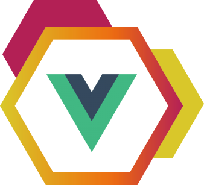

<div align="center">
  
  <h1>Vue Modules</h1>
</div>

<p align="center">
  <b>Vue Module is an vue-cli open source project based on webpack.</b><br>
  Available for macOS, Windows and Linux (Beta).
</p>

# Vue Modules

Vue Module is an vue-cli open source project based on webpack.

[](https://david-dm.org/guastallaigor/vue-modules)
[](https://david-dm.org/guastallaigor/vue-modules?type=dev)
[](https://dependencyci.com/github/guastallaigor/vue-modules)
[](https://github.com/guastallaigor/hare/issues)
[](https://www.codacy.com/app/guastallaigor/vue-modules?utm_source=github.com&amp;utm_medium=referral&amp;utm_content=guastallaigor/vue-modules&amp;utm_campaign=Badge_Grade)
[](http://hits.dwyl.io/guastallaigor/vue-modules)

## Features

* [Vuetify](https://vuetifyjs.com/)
* [Pug](https://pugjs.org/api/getting-started.html)
* [Stylus](http://stylus-lang.com/)
* [Vuex](https://vuex.vuejs.org/en/)
* Modules
* Dotenv

## Project Directory

```
.
+-- package.json
+-- package-lock.json
+-- index.html
+-- .postcssrc.js
+-- .gitignore
+-- .eslintrc.js
+-- .eslintignore
+-- .env
+-- .editorconfig
+-- .babelrc
+-- README.md
+-- config // standard folder, port 8080
+-- build // standard folder
+-- test // standard, not using yet
+-- static
|   +-- .gitkeep
|   +-- favicon-32x32.png
|   +-- v.png
+-- src
|   +-- modules
|   |   +-- Test
|   |   |   +-- Example // example for a module
|   |   |   |   +-- Example.vue // example component
|   |   |   |   +-- ExampleRouter.js // example router
|   |   |   +-- Login // example for a different module, like a login
|   |   |   |   +-- Login.vue // example login component
|   |   |   |   +-- LoginRouter.js // example login router
|   |   +-- Theme
|   |   |   +-- assets
|   |   |   |   +-- logo.png // vuejs logo
|   |   |   +-- components // global components folder
|   |   |   |   +-- AppBar.vue // header component
|   |   |   |   +-- AppFooter.vue // footer component
|   |   |   |   +-- Layout.vue // router component
|   |   |   |   +-- Sidebar.vue // sidebar component
|   |   |   +-- stylus // stylus folder
|   |   |   |   +-- main.styl // main stylus file
|   |   |   |   +-- theme.styl // assign theme colors
|   |   |   +-- App.vue // vuejs app component
|   |   |   +-- bootstrap.js // bootstrap file
|   |   |   +-- index.js // the main.js vue-cli file
|   |   |   +-- ThemeStore.js // store for all the defined themes
|   +-- router
|   |   +-- index.js // main router file
|   +-- store
|   |   +-- index.js // main store file
|   +-- util
|   |   +-- env-plugin.js // js used to import .env file
|   |   +-- import-by-file.js // js used by main router and store
|   +-- main.js // js used to import the modules theme
```

## Contributing

* Fork it !
* Create your branch from develop: git branch example origin develop
* Commit your changes: git commit -am "Detail your modifications"
* Push the branch: git push origin example
* Submit a pull request to develop of hardcodeinc/vue-modules

## Development

#### Code Style
[](https://github.com/feross/standard)

Make sure you have [Node.js](https://nodejs.org) installed, then type the following commands known to every Node developer:
```
git clone https://github.com/szwacz/electron-boilerplate.git
cd vue-modules
npm install
npm run dev
```

## License

MIT © [Hard Code Inc](https://github.com/hardcodeinc/vue-modules)
